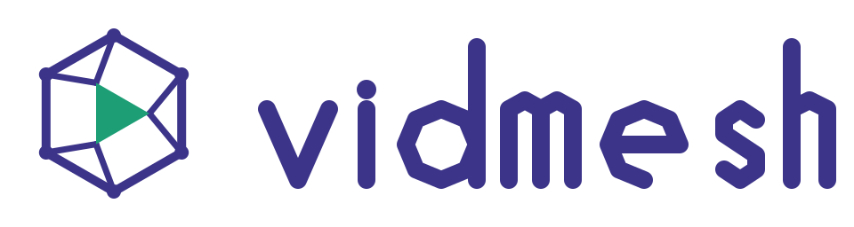
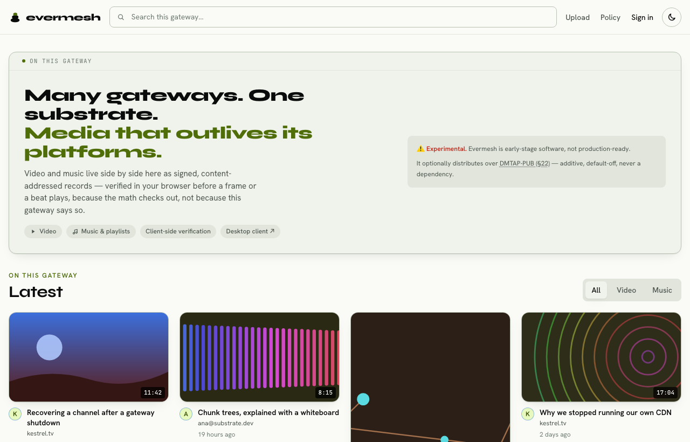
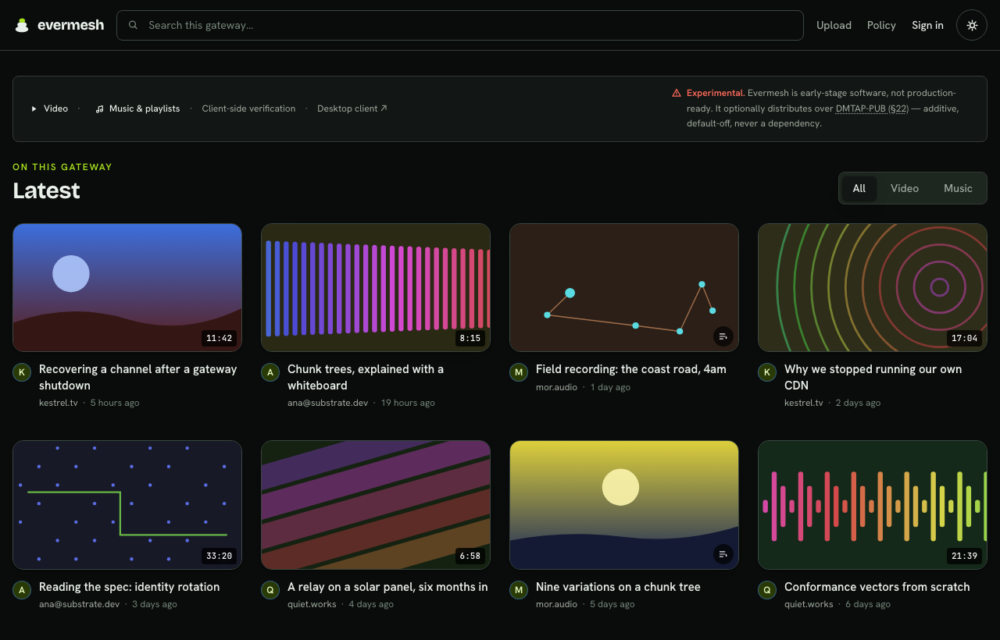
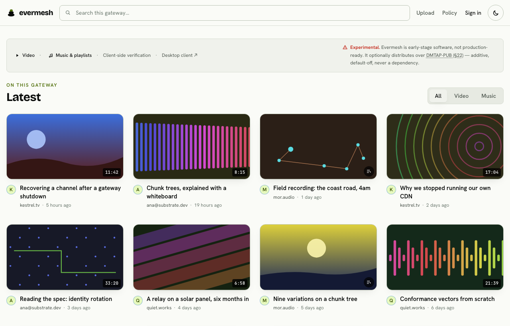
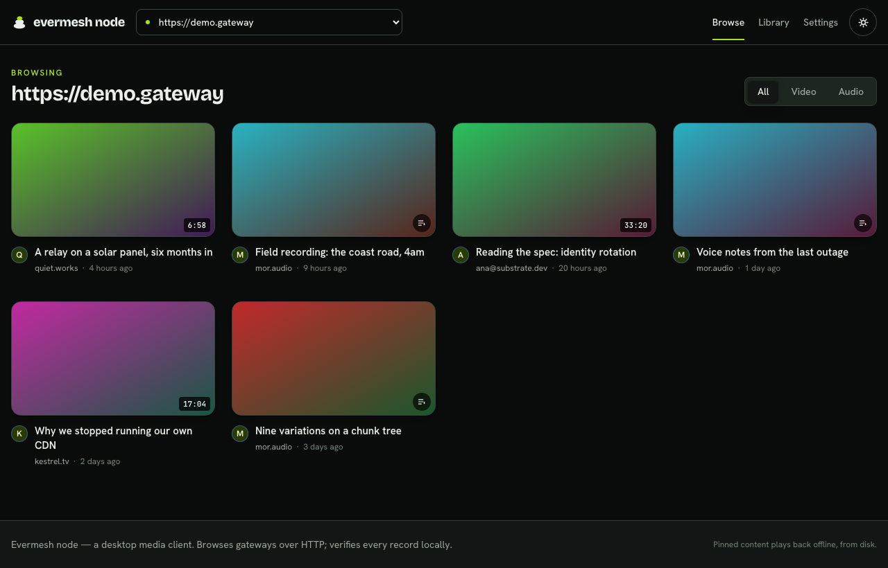
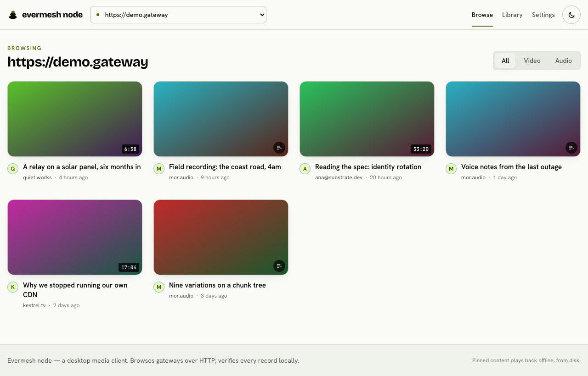
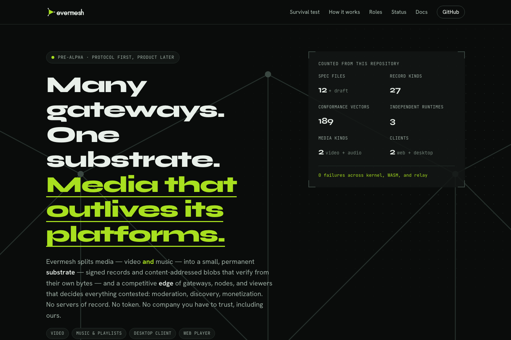
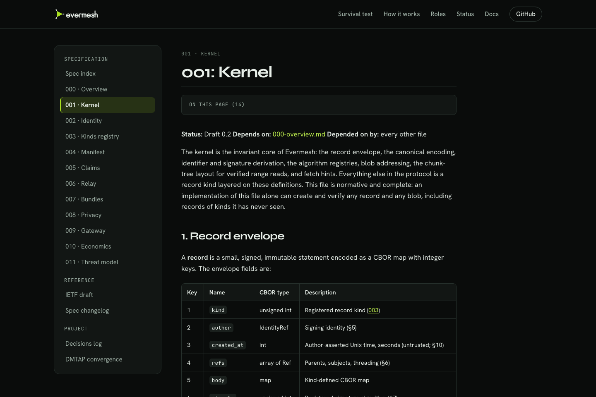
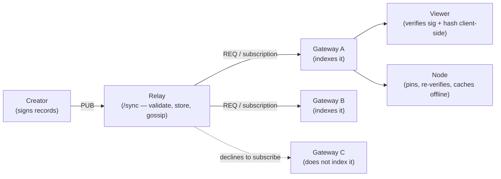

<p align="center">
  <picture>
    <source media="(prefers-color-scheme: dark)" srcset="assets/logo-dark.svg">
    
  </picture>

<sub> Part of <strong><a href="https://vulos.org">VulOS</a></strong> — the open, self-hostable web OS &amp; app suite. Runs standalone, or as an app hosted by the Vulos OS.</sub>
</p>

<p align="center">
  <b>Many gateways. One substrate. Media that outlives its platforms.</b>
</p>

<p align="center">
  
  
  
  
  
  
</p>

<p align="center">
  <picture>
    <source media="(prefers-color-scheme: dark)" srcset="docs/screenshots/hero-dark.png">
    
  </picture>
</p>

> ⚠️ **Experimental.** Evermesh is early-stage software and not
> production-ready — see [Status by component](#status-by-component) below.
> It has its own native substrate (signed records, identity, blobs,
> bundles) and does not require DMTAP for anything; it can *optionally*
> distribute over [DMTAP-PUB (§22)](docs/DMTAP-CONVERGENCE.md) as an
> additive, default-off encode/decode path (`--features dmtap-pub`) for
> interop with the wider DMTAP substrate. Formerly named **Boloka**, and
> before that **Vidmesh**.

## What is Evermesh?

Evermesh is a decentralized media protocol built on a substrate of
self-certifying data: signed records (CBOR, Ed25519, BLAKE3) and
content-addressed blobs. No servers of record, no token, no mandatory
dependencies. Independent **gateways** index and serve their own selection
of the substrate; **nodes** pin and seed chosen content; **viewers** verify
everything client-side while they watch. See
[Concepts](docs/CONCEPTS.md) for the model in plain language.

**Status: pre-alpha.** The protocol kernel, the relay, the WASM/TS bindings,
the gateway backend and web frontend, and the cross-implementation
conformance suite are implemented and — as of this writing — their test
suites **run and pass** (verified directly for this pass; see below). This
is not shipped software: there is no deployment, no swarm/P2P transport,
and no live-streaming product surface. The desktop node app
(`crates/evermesh-node`) browses a gateway, verifies natively, and pins for
offline playback, but does not seed to other nodes — see
[Status by component](#status-by-component). The [spec](spec/) is
normative; where code and spec disagree, the spec wins.

### Status by component

| Path | What it is | State |
|---|---|---|
| `spec/` | Normative protocol spec (000–011 + IETF draft), CC-BY-SA-4.0 | **Complete** for v1 scope |
| `crates/evermesh-kernel` | Records, identity/rotation, blobs+chunk proofs, bundles, canonical codec, all 27 record kinds | **Implemented, tested** — 201 unit + 7 property + 4 frozen chunk-tree-profile tests, all re-run for this pass (`cargo test -p evermesh-kernel`) |
| `crates/evermesh-relay` | Axum `/sync` websocket relay: envelope validation, storage, filtered subscriptions, gossip, PoW, rate-limit, retention, blob sidecar (PUT/GET-range/proof) | **Implemented, tested** — 47 tests, re-run for this pass |
| `crates/evermesh-wasm` | wasm-bindgen bindings over the kernel | **Implemented**, builds to WASM, tested |
| `packages/kernel-ts` | Typed TS API over the WASM kernel | **Implemented, tested** — 7 tests, re-run for this pass |
| `packages/ui` | Shared React components (player, verification badge) | **Implemented**, typechecks |
| `apps/gateway/server` | Gateway backend: config, SQLite index, policy engine, key custody, relay clients, kind-aware ingest, upload/original-only pipeline, JSON API | **Implemented, tested** — 45 tests, re-run for this pass; boots and connects to a relay |
| `apps/gateway/web` | Gateway frontend: React + Vite + Tailwind | **Implemented, tested** — 45 tests, re-run for this pass; builds |
| `site` | vulos.org/projects/evermesh: static landing page + docs viewer | **Built**, browser-checked (`just site-check`) |
| `tools/conformance` | 189 deterministic vectors + a runner replaying them against three runtimes, with an asserted coverage manifest | **Implemented, green** (see [Conformance](#conformance-the-golden-rule) below); kernel target runs in `cargo test --workspace`, node + relay targets in their own CI job |
| `crates/evermesh-node` + `apps/node-web` | Desktop media client (Tauri 2): browses a gateway, verifies manifests natively, pins for offline playback | **Implemented, tested**; no P2P/swarm retrieval (gateway-HTTP + offline cache only) |

### Spec'd but not built

- **Swarm / P2P retrieval, WebRTC, BitTorrent-style transport** — described in
  the spec and threat model; **no implementation**. Blob retrieval today is
  the relay's HTTP sidecar only.
- **Live streaming** — the `live.manifest` / `live.chat` record **kinds**
  exist and validate in the kernel, but there is **no live ingest, no
  player, and no product surface**.
- **Non-custodial key flows** — the reference gateway custodies keys
  server-side (spec 002 §7 / 009 §5); client-held keys are a later phase.
- **Desktop node seeding** — `crates/evermesh-node` pins (downloads,
  re-verifies, and caches) content for its owner, but does not seed it to
  other nodes; there is no swarm/P2P transport for it to seed over (same
  gap as the point above).

## Part of VulOS

Evermesh is one of VulOS's independently self-hostable products: a
decentralized media protocol and reference implementations (relay,
reference gateway, desktop node client), not a managed service. It runs
standalone — nothing above requires a Vulos box, a Vulos account, or any
other VulOS product — and it can equally be hosted as an app inside the
Vulos OS, the same way any of the suite's other apps are. Evermesh never
imports another VulOS product; where it interoperates with the wider DMTAP
substrate it does so through the explicit, additive, default-off
`dmtap-pub` feature described above, never as a hard dependency. Learn more
about the suite at [vulos.org](https://vulos.org).

## Features

- **Self-certifying records** — CBOR envelope, Ed25519 signatures,
  BLAKE3-256 ids; verifiable from their own bytes with no server in the
  loop (`crates/evermesh-kernel`, spec [001](spec/001-kernel.md)).
- **27 record kinds** at launch — manifests, claims, comments, reactions,
  playlists, live streams, compliance notices, and more (spec
  [003](spec/003-kinds-registry.md)).
- **Content-addressed blobs with range proofs** — 1 MiB BLAKE3 chunk trees,
  so a byte range in the middle of a large file is provable without
  downloading the whole thing.
- **Identity as a rotation log, not an account** — recovery-precedence key
  rotation, no username/password system at the protocol level (spec
  [002](spec/002-identity.md)).
- **A relay** (`crates/evermesh-relay`) with envelope validation, filtered
  subscriptions, gossip, proof-of-work admission, rate-limiting, retention,
  and an optional blob sidecar (PUT / ranged GET / chunk proof).
- **A reference gateway** (`apps/gateway/server` + `apps/gateway/web`) —
  policy engine, key custody, kind-aware ingest, upload pipeline, and the
  **uniform reference UI** every gateway ships (spec
  [009 §7](spec/009-gateway.md)); operators re-skin accent colors, not the
  interface.
- **A desktop node client** (`crates/evermesh-node`, Tauri 2) that browses
  a gateway, verifies every manifest natively in Rust, and pins content for
  offline playback — see [Spec'd but not built](#specd-but-not-built)
  for what it does not yet do.
- **No token, no mandatory dependencies** — payment pointers are a rail-
  agnostic registry (spec [010](spec/010-economics.md)); a protocol token
  is permanently out of scope.
- **Optional DMTAP-PUB §22 interop** — an additive, default-off
  `--features dmtap-pub` path proving byte-for-byte agreement with the
  wider DMTAP substrate's conformance vectors, documented in
  [docs/DMTAP-CONVERGENCE.md](docs/DMTAP-CONVERGENCE.md); the native format
  is untouched unless the feature is enabled.

### Conformance: the golden rule

The suite replays the same vectors against three independent runtimes — the
`evermesh-kernel` crate in-process, `@evermesh/kernel` under Node/WASM, and a
live `evermesh-relay` over its `/sync` websocket. **A vector must pass
identically in every runtime**; a divergence is a protocol/binding bug,
never a fixture to special-case. Result below was re-run for this pass
(`cargo run --bin evermesh-conformance -- run --target <kernel|node|relay>`,
real output, not restated from a prior run):

| Target | Pass | Fail | Skip | What it declines to check |
|---|---:|---:|---:|---|
| kernel | 189 | 0 | 0 | nothing — it is the reference |
| node (WASM/kernel-ts) | 177 | 0 | 12 | bundle import/export and non-record JSON: no such surface in `@evermesh/kernel` |
| relay (`/sync`) | 115 | 0 | 74 | everything but the envelope — relays envelope-validate only (spec 006 §4) |

Every skip is printed by name with its reason under a `NOT VERIFIED`
heading, and every run checks itself against
`tools/conformance/coverage.json`, which declares the exact per-group
vector counts and the exact pass/fail/skip shape each target must produce.
A run that verifies less than the suite claims to — a shrunken corpus, a
group that vanished, a check that turned into a skip — exits nonzero
instead of reporting a clean table. See
[`tools/conformance/README.md`](tools/conformance/README.md).

## Screenshots

The **uniform reference UI** (spec [009 §7](spec/009-gateway.md)) is the one
interface every gateway ships. An operator may re-skin its accents by
overriding the `--bo-*` tokens in
[`apps/gateway/web/src/styles/index.css`](apps/gateway/web/src/styles/index.css)
— and nothing else. The brand those tokens carry (palette, type, the
measured contrast table) is documented in [`assets/README.md`](assets/README.md).

| Reference UI — dark | Reference UI — light |
|---|---|
|  |  |

| Desktop client (Tauri) — dark | Desktop client (Tauri) — light |
|---|---|
|  |  |

> These four are the real frontends served against a **stubbed** gateway
> API / a **stubbed** Tauri IPC boundary (`node tools/brand/ui-shots.mjs`,
> `node tools/brand/node-shots.mjs`), because no evermesh gateway is
> deployed and there is no built desktop binary in this environment — see
> the status table above. They show the interfaces, not a running network.
> The hero image at the top of this file is a copy of `ui-dark`/`ui-light`
> kept at [`docs/screenshots/`](docs/screenshots/) so this README never
> hotlinks into `site/`.

| vulos.org/projects/evermesh | Docs viewer |
|---|---|
|  |  |

The site in [`site`](site/) is static and self-contained;
`just site-check` drives a real browser over it (console errors, links,
every docs route, both themes) and `just site-shots` refreshes these
images.

## Quick start (standalone)

Evermesh runs with nothing else in the suite. Three ways in, from cheapest
to most complete:

### Docker — two relays, gossiping

```sh
docker compose up --build
curl http://localhost:8787/info
curl http://localhost:8788/info
```

This boots `crates/evermesh-relay/Dockerfile` twice (`deploy/relay1.json`,
`deploy/relay2.json`), peered over the internal Docker network — it's the
same shape the `relay/gossip-*` conformance vectors exercise. **Not
verified for this pass**: the Docker daemon was not reachable in this
environment, so this command is documented, not freshly run; it is also
not exercised by CI (`.github/workflows/ci.yml` boots the relay natively,
not via Docker). `cargo build -p evermesh-relay` (the same binary the
Dockerfile packages) was verified in this pass and compiles clean.

### From source — relay + gateway, no ffmpeg required

Real output from this pass, run end-to-end against a freshly built relay:

```sh
cargo build --workspace

mkdir -p smoke/blobs
cat > smoke/relay.json <<'JSON'
{
  "listen_addr": "127.0.0.1:8787",
  "db_path": "smoke/relay.sqlite3",
  "name": "smoke-relay.local",
  "pow_min_bits": 0,
  "blob": { "enabled": true, "dir": "smoke/blobs", "max_bytes": 4294967296 }
}
JSON
./target/debug/evermesh-relay smoke/relay.json &

# Put a blob; the server derives (never trusts) its content address
printf 'hello evermesh smoke test blob payload' > smoke/payload.bin
ID=$(curl -s -X PUT --data-binary @smoke/payload.bin \
       http://127.0.0.1:8787/blob | sed -E 's/.*"id":"([^"]+)".*/\1/')

# Fetch it back whole, then a byte range (expect 206 Partial Content)
curl -s "http://127.0.0.1:8787/blob/$ID" | diff - smoke/payload.bin && echo "round-trip OK"
curl -s -i -H "Range: bytes=6-13" "http://127.0.0.1:8787/blob/$ID" | head -5

# Boot the gateway against the relay (config omits ffmpeg = original-only)
cp apps/gateway/server/config.example.json smoke/gateway.json   # then edit paths/secrets,
                                                                # set relays to ws://127.0.0.1:8787/sync
GATEWAY_CONFIG=smoke/gateway.json \
  pnpm --filter @evermesh/gateway-server exec node --experimental-transform-types src/main.ts
# GET http://127.0.0.1:8080/api/info  ->  200 {"gateway":...,"relays":[...],"uploadEnabled":true}
```

The blob put/round-trip/range steps above were run for this pass; the
relay came up, accepted the PUT, and served the round-trip and a `206
Partial Content` range response as documented. `ffmpeg`/`ffprobe` are
**optional** — without them the gateway runs an original-only upload path
(no renditions/HLS).

### Minimal config

`apps/gateway/server/config.example.json` and `policy.example.json` are the
starting points; the only fields you must change from the example are a
real `sessionSecret` and `custody.secret` (32+ chars each) and `relays`
(point it at your relay's `/sync` URL). See
[Configuration](#configuration) below for the relay side.

## How it works



Creators publish signed records into the substrate; relays carry those
records to whoever subscribes; gateways pick a selection and serve it under
their own policy; nodes pin what their owners choose; viewers verify
everything themselves as they watch. No piece in that chain has to trust
any other piece — each one checks what it's handed against math, not
against reputation. A hand-drawn version of the same diagram, in the site's
brand style, is [`assets/architecture.svg`](assets/architecture.svg); the
plain-language walkthrough (with two more diagrams, for identity and
offline playback) is [Concepts](docs/CONCEPTS.md).

## Configuration

**Relay** (`evermesh-relay <path-to-config.json>`) — JSON, no env vars:

| Field | Meaning |
|---|---|
| `listen_addr` | `host:port` to bind |
| `db_path` | SQLite file for the record index |
| `name` | relay's self-reported name (`GET /info`) |
| `pow_min_bits` | minimum proof-of-work leading-zero bits a `PUB` must carry; `0` disables it |
| `blob.enabled` | turn the optional blob sidecar (PUT/GET-range/proof) on or off |
| `blob.dir` | directory blobs are stored under |
| `blob.max_bytes` | per-blob size ceiling |

See [`spec/006-relay.md`](spec/006-relay.md) for the full field set and the
gossip-peer list shape.

**Gateway server** (`apps/gateway/server`) — reads `GATEWAY_CONFIG`
(defaults to `config.json` in its own directory) plus a separate
`policy.json`; `config.example.json` and `policy.example.json` are the
annotated templates. Required non-default fields: `sessionSecret`,
`custody.secret` (both 32+ chars), and `relays` (one or more `ws://.../sync`
URLs). `ffmpegPath` is optional — omit it and uploads are served
original-only, no transcoded renditions or HLS.

**Gateway web** (`apps/gateway/web`) — a Vite dev server that proxies `/api`
to the gateway server; no separate config file for a local run
(`VITE_API_BASE` overrides the proxy target if you need it pointed
elsewhere).

## Documentation

Grouped in the same order as the site's docs nav
([vulos.org/projects/evermesh](https://vulos.org/projects/evermesh)):

**Start here**

| Doc | What's in it |
|---|---|
| [docs/GETTING-STARTED.md](docs/GETTING-STARTED.md) | Run a relay, a gateway, and the desktop client, from a clone |

**Concepts**

| Doc | What's in it |
|---|---|
| [docs/CONCEPTS.md](docs/CONCEPTS.md) | The protocol model in plain language, with diagrams |

**Protocol specification** (advanced — 000–011, unrenumbered)

| Doc | What's in it |
|---|---|
| [spec/README.md](spec/README.md) | Spec index and how to build the PDF |
| [spec/000-overview.md … 011-threat-model.md](spec/) | The normative protocol specification (Draft 0.2) |
| [spec/draft-evermesh-protocol-00.md](spec/draft-evermesh-protocol-00.md) | Single-document IETF-style rendering of the spec |

**Reference & project**

| Doc | What's in it |
|---|---|
| [docs/ARCHITECTURE.md](docs/ARCHITECTURE.md) | Repo layout, crate/package/app map, and test strategy — for contributors |
| [docs/DMTAP-CONVERGENCE.md](docs/DMTAP-CONVERGENCE.md) | The DMTAP-PUB §22 interop decision, in full |
| [DECISIONS.md](DECISIONS.md) | Judgment-call log: why things are shaped the way they are |
| [CHANGELOG.md](CHANGELOG.md) | What changed, release by release |
| [SECURITY.md](SECURITY.md) | Vulnerability reporting and security scope |
| [tools/conformance/README.md](tools/conformance/README.md) | How the cross-runtime conformance suite works |

All of the above (except `docs/ARCHITECTURE.md`, which is contributor-only
and intentionally not published) are mirrored byte-identically into
[`site/docs/`](site/docs/) by `tools/site/sync-docs.mjs` and served at
[vulos.org/projects/evermesh](https://vulos.org/projects/evermesh) — the
copies are checked in CI (`just site-check`), so `site/docs/` never drifts
from these sources. The default docs route there is `getting-started`, not
`000-overview` — this table's order matches that.

## Development

Prerequisites: Rust stable, Node ≥ 22 (24 recommended), pnpm,
[`just`](https://github.com/casey/just). `ffmpeg`/`ffprobe` are **optional** —
without them the gateway runs an original-only upload path (no renditions/HLS).

```sh
just setup          # pnpm install
just wasm           # build the WASM kernel into packages/kernel-ts/wasm
just test           # cargo test --workspace + pnpm -r test
```

Per-suite, if you want to run them individually (all re-run for this pass,
real pass counts shown):

```sh
cargo test --workspace                          # kernel, relay, wasm, node, conformance
pnpm --filter @evermesh/kernel build && \
  pnpm --filter @evermesh/kernel test            # TS kernel (needs `just wasm` first) — 7 tests
pnpm --filter @evermesh/gateway-server test      # gateway backend — 45 tests
pnpm --filter @evermesh/gateway-web test         # gateway frontend — 45 tests
```

### Conformance suite

The kernel target already runs inside `cargo test --workspace`
(`tools/conformance/tests/kernel_conformance.rs`). To drive the runner
directly, or to reach the other two runtimes:

```sh
cargo run --bin generate                        # (re)generate vectors — deterministic
just conformance                                # kernel target, human-readable table
just conformance-node                           # needs `just wasm` + kernel-ts build
# relay target needs a live relay (see the smoke run above), then:
just conformance-relay                          # or: conformance-relay ws://host:port/sync
just conformance-all                            # all three, the golden rule in full
```

Adding or removing a vector is expected to change
`tools/conformance/coverage.json` in the same commit; the runner fails until
it does.

`just spec-pdf` renders the protocol spec (requires pandoc + tectonic) —
re-run for this pass: it wrote a 111 KB `dist/evermesh-protocol-draft-00.pdf`
with only harmless line-break overfull/underfull `\hbox` warnings, no errors.

### Site and brand

```sh
just site-serve     # preview site at http://127.0.0.1:8080
just site-check     # docs-copy sync check + real-browser check of the site
just site-shots     # refresh the site/docs screenshots
just ui-shots       # refresh the gateway reference-UI screenshots
just node-shots     # refresh the desktop (Tauri) client screenshots
just shots          # all three of the above
just brand          # re-render the OG card and apple-touch-icon
```

`just lint` runs `cargo fmt --all --check`, `cargo clippy --workspace
--all-targets -- -D warnings`, and `pnpm -r --if-present lint` — all three
re-run individually for this pass, all clean (fmt: no diff; clippy: zero
warnings; `tsc --noEmit` across all five TS packages: done, no errors). See
`.github/workflows/ci.yml` for exactly what CI enforces on every push.

The mark in [`brand/`](brand/) is the source of truth. Every icon this repo
ships — favicon, PWA and app icons, the mark in the README and on the
site — is rendered from `brand/logo.svg` rather than redrawn, so there is
one approved drawing and no second copy to drift. Copy it outward, never
edit a derived copy, and never edit `brand/` to match something
downstream.

## Contributing

Spec before code: a protocol change lands in the relevant `spec/NNN-*.md`
file (with a `DECISIONS.md` entry explaining the call) before any
implementation follows it. New record kinds and other protocol extensions
are subject to [spec 000 §3, principle 9](spec/000-overview.md#3-design-principles-normative), the
**two-implementations rule** — an extension does not enter the
specification until two independent implementations interoperate against
the public conformance suite (`tools/conformance/`).

Before opening a PR: `just lint` and `just test` clean, and if you touched
`spec/` or added/removed a conformance vector, `tools/conformance/coverage.json`
and `spec/CHANGELOG.md` are updated in the same commit — both are checked,
not just conventions. Issues and PRs: [github.com/vul-os/evermesh](https://github.com/vul-os/evermesh).

## License

Code: MIT OR Apache-2.0 (`LICENSE-MIT`, `LICENSE-APACHE`).
Spec: CC-BY-SA-4.0 (`LICENSE-SPEC`).

---

<p align="center">
  <a href="https://vulos.org"></a><br>
  <sub><a href="https://vulos.org"><b>vulos</b></a> — open by design</sub>
</p>
